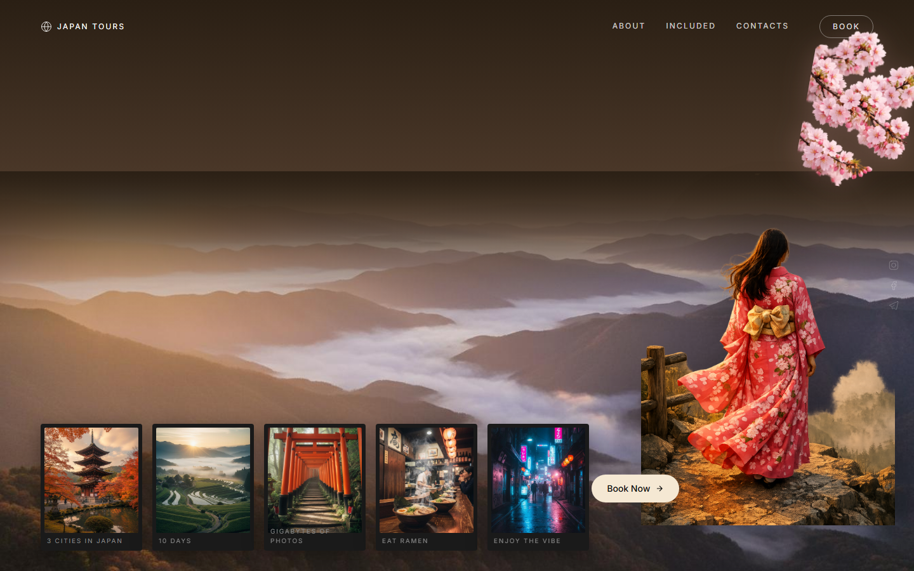

# 🗻 Japan Tours — Cinematic Landing Page

An editorial, scroll-driven landing page for a 10‑day Japan tour, styled as *Wes Anderson meets Studio Ghibli* — layered depth, intentional pacing, and art‑directed motion.

[](https://roxstar25.github.io/japan-tour/)
[](https://github.com/Roxstar25/japan-tour/actions/workflows/deploy.yml)

### 👉 **[View the live site](https://roxstar25.github.io/japan-tour/)**



---

## Overview

A single‑page, fully responsive marketing site built as a polished front‑end showcase. The hero composites a mountain landscape, layered display typography, and a foreground kimono figure into a cinematic scene, then drives the whole page with smooth, scroll‑linked motion.

The focus of this build is **craft**: precise layering, GPU‑accelerated parallax, viewport‑triggered reveals, a custom cursor, and full `prefers-reduced-motion` support — the details that separate a production site from an AI demo.

## ✨ Features

- **Layered cinematic hero** — display typography sits *behind* the mountains via a CSS mask, with a foreground kimono figure and cherry‑blossom framing for real depth.
- **Scroll‑linked parallax** — mountains, type, and the polaroid strip move at different speeds (0.3×–0.5×) for a sense of distance, tied precisely to scroll position.
- **Smooth scrolling** — momentum scrolling via Lenis, synced to the animation timeline.
- **Editorial timeline reveal** — the Osaka → Kyoto → Tokyo itinerary fades up sequentially as it enters the viewport (staggered 0 / 200 / 400 ms).
- **Hover‑to‑play polaroids** — postcard‑style cards that play short video clips on hover, with a soft sakura‑pink glow.
- **Custom cursor** — an 8px dot + 32px ring with `mix-blend-mode: difference`; the OS cursor is hidden on desktop.
- **Accessible motion** — every scroll/parallax animation is disabled under `prefers-reduced-motion`, leaving content fully visible.
- **Responsive** — tuned from mobile up to large desktops; the custom cursor and heavy effects gracefully degrade on touch devices.

## 🛠️ Tech Stack

| Area | Tools |
|------|-------|
| Framework | [React 19](https://react.dev/) + [TypeScript](https://www.typescriptlang.org/) |
| Build tool | [Vite 7](https://vite.dev/) |
| Styling | [Tailwind CSS 3](https://tailwindcss.com/) + design tokens |
| UI primitives | [shadcn/ui](https://ui.shadcn.com/) (Radix) |
| Motion | [GSAP](https://gsap.com/) + ScrollTrigger |
| Smooth scroll | [Lenis](https://github.com/darkroomengineering/lenis) |
| Hosting | GitHub Pages (via GitHub Actions) |

## 🚀 Getting Started

```bash
# clone
git clone https://github.com/Roxstar25/japan-tour.git
cd japan-tour/app

# install
npm install

# run the dev server (http://localhost:3000)
npm run dev
```

### Other scripts

```bash
npm run build     # type-check + production build to app/dist
npm run preview   # preview the production build locally
npm run lint      # run ESLint
```

## 🏗️ Deployment

Deployment is fully automated. Every push to `main` triggers the
[GitHub Actions workflow](.github/workflows/deploy.yml), which builds the app in
`app/` and publishes `app/dist` to GitHub Pages — no manual steps.

Asset paths are relative, so the site works correctly when served from a project
subpath (`/japan-tour/`).

## 📁 Project Structure

```
.
├── app/                      # the Vite + React application
│   ├── public/               # static images & video clips
│   └── src/
│       ├── components/       # CustomCursor + shadcn/ui primitives
│       ├── sections/         # Hero, About, Included, Contact, Footer
│       ├── App.tsx           # root: Lenis smooth scroll + section layout
│       └── index.css         # design tokens, fonts, global styles
├── docs/                     # screenshots / preview assets
└── .github/workflows/        # GitHub Pages deploy pipeline
```

## ♿ Accessibility

The site honours the OS‑level **Reduce Motion** preference: parallax, smooth
scrolling, and reveal animations are switched off, and all content renders in its
final, static position. CSS transitions are neutralized via a global
`prefers-reduced-motion` media query.

---

## 👤 Author

**Roxstar25** — front‑end / creative web development.
Available for freelance work on [Upwork](https://www.upwork.com/).

> Built as a demonstration of cinematic, motion‑rich marketing sites. Want
> something like this for your brand? Let's talk.

## 📄 License

Released under the [MIT License](LICENSE). Photography and video clips are used
for demonstration purposes only.
